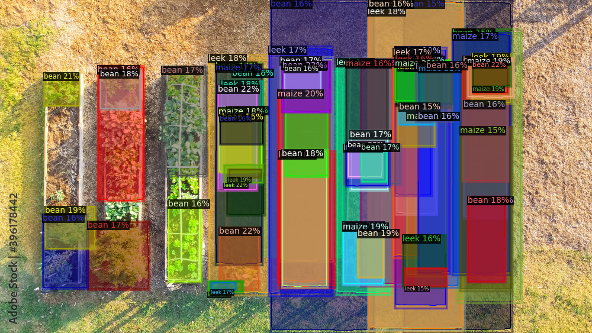
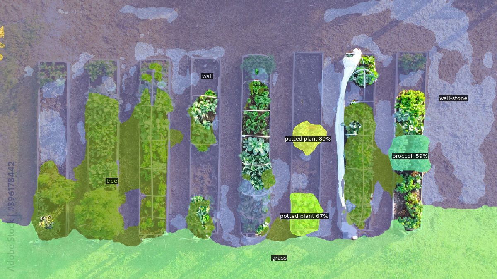
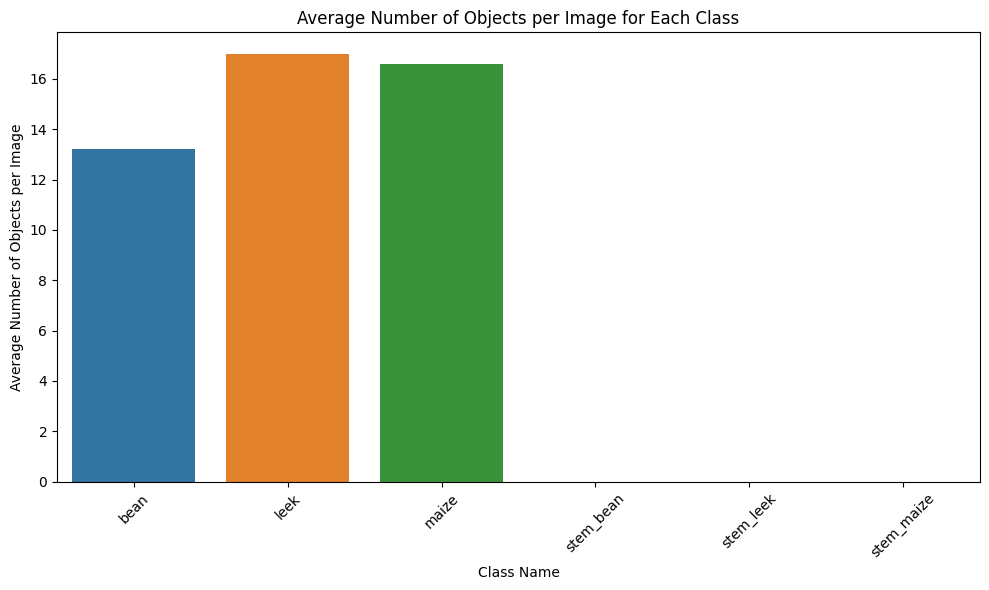

## Mask_R-CNN_segmentation
#Training Mask R-CNN model for instance &amp; panoptic segmentation using Custom images in COCO label format, Detectron SDK &amp; Torch  

This notebook trains a MASK R-CNN model from Detectron2 SDK from the scratch (NOT fine tuning a model's checkpoint) using a set of vegetable bed images to test image segmentation, instance segmentation and panoptic segmentation over new images.  

Training batch size=256 over 1000 iterations to classify into 6 labels.

# Image Segmentation output

# Panoptic segmentation output

# Detected labels
